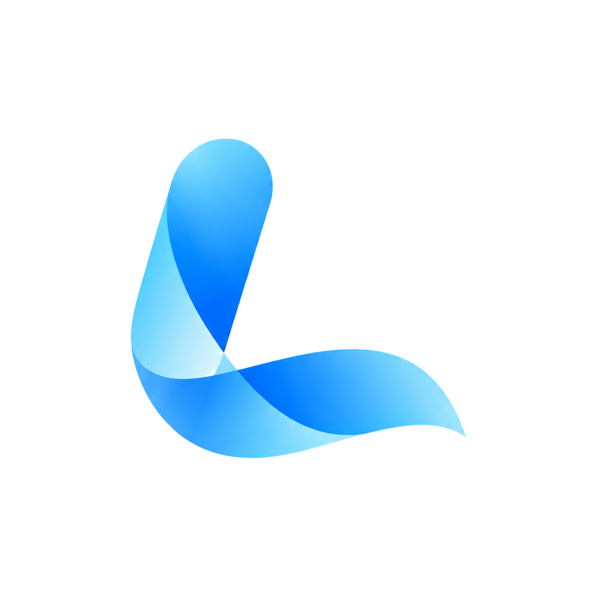

# Levik VPN для macOS

  

  Ваш привычный Levik VPN — теперь на Mac. 
  Удобный вертикальный интерфейс, обычные и мобильные серверы, подключение одной кнопкой.

  <a href="https://github.com/Nort321/levik-vpn-macos/releases/latest">Скачать для Mac</a> ·
  <a href="https://leviknet.com">Официальный сайт</a> ·
  <a href="https://t.me/leviksupportbot">Поддержка</a>

  
  

## Всё необходимое для подключения

- **Одна кнопка** — включайте и отключайте VPN с главного экрана.
- **Ваш Levik Account** — подписки и доступные серверы в одном приложении.
- **Обычные и мобильные серверы** — выбирайте подходящий вариант подключения.
- **Удобный выбор сервера** — поиск, избранное и автоматический подбор.
- **Защита при обрыве** — блокировка трафика и автоматическое переподключение.
- **Исключения для приложений** — выбирайте, какие программы используют VPN.
- **Статистика подключения** — следите за трафиком и временем сеанса.
- **На вашем Mac** — темы оформления, запуск при входе и управление из строки меню.

## Установка

Требуется **macOS 13 или новее**.

1. Откройте [последний релиз](https://github.com/Nort321/levik-vpn-macos/releases/latest) и скачайте подходящий файл **DMG**.
2. Откройте его и перетащите **Levik VPN** в папку **«Программы»**.
3. Запустите приложение, войдите в **Levik Account** и выберите сервер.
4. Нажмите кнопку подключения и подтвердите системный запрос macOS.

| Ваш Mac | Какой DMG выбрать |
| --- | --- |
| С чипом Apple M1, M2, M3 или новее | Файл с **arm64** в названии |
| С процессором Intel | Файл с **x64** в названии |

Тип процессора можно посмотреть в меню ** → Об этом Mac**.

Если macOS не открывает приложение, разрешите запуск в **«Системные настройки → Конфиденциальность и безопасность»**.

Для обновления скачайте новый DMG и замените приложение в папке «Программы».
Пока репозиторий приватный, для скачивания нужен вход в GitHub с доступом к нему.

## Нужна помощь?

Напишите в [поддержку Levik](https://t.me/leviksupportbot).
Информация об обработке данных доступна в [политике конфиденциальности](https://leviknet.com/legal/privacy).

## Об этом репозитории

Здесь находятся исходники macOS-приложения Levik VPN. Репозиторий пока приватный.
Описание новых версий и установщики доступны в [релизах](https://github.com/Nort321/levik-vpn-macos/releases).

[Лицензия](LICENSE) · [Сообщить об уязвимости](SECURITY.md) · [Документация](docs/development.md)
